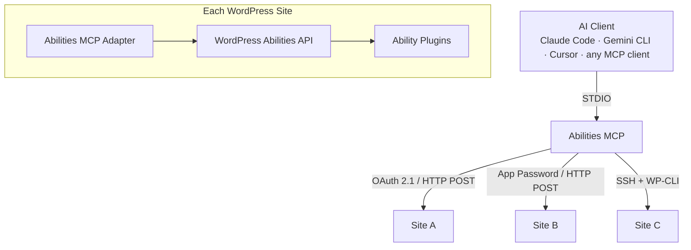

# Abilities MCP

> **A word from J, the director of this creation.**
>
> Everything you see here is built by a single human who does not read or write code and is written by AI. Everything is in constant motion and by observing that movement we create the illusion of being still. Change happens at any given moment. It is simply a law of evolution. Stillness is an act of conscious awareness, not a reality of life.

## Welcome, Wordpressnaut

Here is the spaceship, now you'll have to learn how to fly and please do remember, humans make mistakes, humans created AI so AI makes mistakes. Learning to fly is your job and to do that you'll need structure, systems, checklists, principles and understanding you stand before a magical leap of a steep and wonderful learning curve. Be patient and do backup things.

→ Knowledge layer (deeper traversal): [https://knowledge.wickedevolutions.com](https://knowledge.wickedevolutions.com)
→ [https://wickedevolutions.com](https://wickedevolutions.com)
→ [https://abilitiesforai.io](https://abilitiesforai.io)

Our development aim is the *Official WordPress Compatibility Contract* — see [PRINCIPLES.md](PRINCIPLES.md) for the full binding principles across the four-repo suite.

---

Open-source MCP bridge that connects any AI client to your WordPress sites through the [WordPress Abilities API](https://developer.wordpress.org/reference/functions/wp_register_ability/). Single STDIO server, multi-site routing, OAuth 2.1 or Application Password authentication, zero npm dependencies.

## Features

- **Multi-site routing** — Single MCP server serves all your WordPress sites
- **OAuth 2.1** — Dynamic Client Registration, PKCE, browser-loopback consent, keychain-backed tokens, automatic refresh, scope expansion
- **Application Password** — Application Passwords with MCP session management (the legacy alpha-supported path; OAuth is recommended)
- **Site parameter injection** — LLM sees a `site` enum on every tool, defaults to your primary site
- **Lazy connections** — Sites connect on first use, not at startup
- **WordPress multisite** — Subdomain-style multisite with cross-site routing through the dot-suffix model
- **Auto-reconnect** — Exponential backoff, healthcheck pings, session recovery
- **Zero npm dependencies** — Node.js built-in modules only

## What You Can Do

The abilities available to your AI agent depend on which ability plugins you install. With [Abilities for AI](https://community.wickedevolutions.com/item/abilities-for-ai/) installed, your agent gets access to:

**Content & Publishing** — content, blocks, patterns, media, menus, taxonomies, comments, revisions
**Site Management** — plugins, themes, settings, users, site health, cache, cron, rewrite rules
**Infrastructure** — filesystem, meta, REST discovery, knowledge layer
**Third-party integrations** — auto-detected modules for supported plugins (Astra, Spectra, SureCart, Presto Player, and more)

**[Abilities for Fluent Plugins](https://github.com/Wicked-Evolutions/abilities-for-fluent-plugins)** is our continuously-enhanced first-party translator — bringing AI control to FluentCRM, FluentCommunity, FluentForms, FluentBooking, FluentSupport, FluentBoards, FluentSMTP, FluentAuth, FluentSnippets, FluentMessaging, FluentCart, and FluentAffiliate. We build and maintain it because we use Fluent's plugins ourselves and wanted them AI-native.

Beyond Fluent, the bridge is plugin-agnostic by design. Any plugin that registers abilities through the WordPress Abilities API becomes available automatically — no configuration in this bridge required. We urge every WordPress plugin developer to prioritize native Abilities API support over anything else.

Every ability enforces `current_user_can()` at execution time — your WordPress role is the security boundary, with OAuth scopes and the [Abilities for AI](https://community.wickedevolutions.com/item/abilities-for-ai/) per-module permission gate as additional layers above it (see [Notes — Four-layer permissions model](#four-layer-permissions-model)).

> **Sign up for the Abilities for AI alpha release:** https://community.wickedevolutions.com/item/abilities-for-ai/

## Install

There are three install paths. Pick the one that matches how you use AI clients. **Path 1 (`.mcpb` for Claude Desktop, with the OAuth upgrade) is the recommended operator entry for the alpha.**

### Set up WordPress (required for all paths)

Create a dedicated WordPress user for AI access and generate an Application Password.

**In WordPress Admin → Users → Add New:**

| Field | Value |
|-------|-------|
| Username | `mcp-agent` (or any name you prefer) |
| Role | **Administrator** for full access, or **Editor** for content-only access |

**Then generate an Application Password:**

Go to **Users → Edit (your mcp-agent user) → Application Passwords**, enter a name (e.g. "MCP Bridge"), and click **Add New Application Password**. Copy the generated password — it's shown only once.

#### Choosing a role

| Role | Access | Use case |
|------|--------|----------|
| **Administrator** | All modules — content, plugins, themes, settings, users, cache, cron, filesystem, and more | Full site management |
| **Editor** | Content, Blocks, Taxonomies, Patterns, Meta, Media | Content publishing workflows — safe for teams where AI writes but does not configure |

> **Tip:** Start with Editor. Move to Administrator when you need infrastructure abilities like plugin management, theme switching, or settings changes.

#### Required plugins

Install both on your WordPress site:

1. **[Abilities for AI](https://community.wickedevolutions.com/item/abilities-for-ai/)** — registers WordPress abilities across content, site management, infrastructure, and third-party integration modules
2. **[Abilities MCP Adapter](https://community.wickedevolutions.com/item/abilities-mcp-adapter/)** — exposes abilities as MCP tools via REST API and runs the OAuth 2.1 resource server + authorization server

Both are available as free downloads from our store, or install from GitHub: [abilities-for-ai](https://github.com/Wicked-Evolutions/abilities-for-ai) and [abilities-mcp-adapter](https://github.com/Wicked-Evolutions/abilities-mcp-adapter).

---

### Path 1 — `.mcpb` bundle for Claude Desktop with OAuth upgrade (recommended)

The full alpha-recommended operator path: install the `.mcpb` for single-click Claude Desktop integration, then upgrade in place to OAuth so tokens live in your OS keychain (macOS Keychain / Windows Credential Manager) and refresh automatically.

#### Step 1 — install the `.mcpb` (Application Password baseline)

1. Download `abilities-mcp.mcpb` from the [latest GitHub Release](https://github.com/Wicked-Evolutions/abilities-mcp/releases/latest).
2. Double-click the file. Claude Desktop opens an "Install Extension" dialog.
3. Type three things:
   - **WordPress Site URL** — `https://example.com`
   - **WordPress Username** — `mcp-agent`
   - **Application Password** — paste the password from the WordPress setup step
4. Click **Install**. The connection is live with an Application Password.

The bundle covers the single-site case. To unlock OAuth, multi-site, and the `add-site` / `reauth` / `revoke` / `list-sites` / `test` operator flows, continue to Step 2.

#### Step 2 — install the CLI globally for OAuth and multi-site flows

```bash
npm install -g @wickedevolutions/abilities-mcp
```

This puts the `abilities-mcp` command on your PATH so you can run the OAuth subcommands from a terminal.

#### Step 3 — upgrade your Claude Desktop site to OAuth in place

```bash
abilities-mcp upgrade-auth <site>
```

This runs the OAuth 2.1 authorization-code flow with PKCE in your default browser, mints fresh tokens, writes them to your OS keychain, and updates `~/.abilities-mcp/wp-sites.json` so the existing Claude Desktop "Abilities MCP" entry now uses OAuth. The Application Password fallback stays in place until you confirm with `--confirm` in a follow-up `upgrade-auth` run.

#### Step 4 — add additional sites (OAuth by default)

```bash
abilities-mcp add-site https://second-site.com
abilities-mcp add-site https://third-site.com --label="My Staging Site"
```

Each added site provisions OAuth via Dynamic Client Registration, runs the consent flow in your browser, and persists tokens to the keychain. New sites surface through the same Claude Desktop "Abilities MCP" entry — no Claude Desktop config edit needed.

For App Password sites instead of OAuth (legacy path), pass `--apppassword --username=<user> --password=<pw>`.

#### Step 5 — expand scopes when broader powers are needed

Default OAuth grants are baseline-scoped — they cover the common read/write categories (`abilities:read`, `abilities:write`, `abilities:multisite:read`, `abilities:multisite:write`). For delete-tier operations, sensitive WordPress core categories (`users`, `settings`, `filesystem`, `plugins`, `cron`, `themes`, `rewrite`), suite scopes (`astra`, `spectra`, `surecart`, `surecart-ecommerce`, `presto-player`), or Fluent suite scopes, extend explicitly:

```bash
abilities-mcp reauth <site> --add-scope="abilities:users:delete abilities:settings:write"
```

The `--add-scope=` flag merges the new scopes into the existing set (deduped, order-preserved). Use `--remove-scope=` to drop scopes by exact match, or `--scope=` to replace the entire set (warns if dropping any). The three flags are mutually exclusive.

**macOS keychain note (since v1.6.0).** On macOS, the bridge uses `/usr/bin/security` as its keychain backend by default under the `auto` backend setting. Every bridge spawn — Claude Desktop, Claude Code, Codex, terminal CLI — issues keychain syscalls through the same caller binary, so macOS's per-binary ACL trusted-application list contains exactly one entry. After your first "Always Allow" the entry reads silently from every runtime. If you upgraded from v1.5.x and Claude Desktop repeatedly asks for keychain access, click **Always Allow** once at the prompt OR run `abilities-mcp add-site --force <site>` / `abilities-mcp reauth <site>` to write a fresh entry under the unified backend.

---

### Path 2 — Env vars (Claude Code, Cursor, Docker, any MCP client)

Install the bridge from npm, then point your client at it with three environment variables:

```bash
npm install -g @wickedevolutions/abilities-mcp
```

In your client's MCP config:

```json
{
  "mcpServers": {
    "wordpress": {
      "command": "abilities-mcp",
      "env": {
        "ABILITIES_MCP_URL": "https://example.com",
        "ABILITIES_MCP_USERNAME": "mcp-agent",
        "ABILITIES_MCP_PASSWORD": "xxxx xxxx xxxx xxxx xxxx xxxx"
      }
    }
  }
}
```

The endpoint is auto-derived as `<URL>/wp-json/mcp/abilities-mcp-adapter-default-server`. Single-site, Application Password only — for OAuth or multi-site, use Path 1 or Path 3.

For `claude mcp add` users:

```bash
claude mcp add wordpress \
  --env ABILITIES_MCP_URL=https://example.com \
  --env ABILITIES_MCP_USERNAME=mcp-agent \
  --env ABILITIES_MCP_PASSWORD='xxxx xxxx xxxx xxxx xxxx xxxx' \
  -- abilities-mcp
```

---

### Path 3 — `wp-sites.json` (multi-site, power users)

Use this when you want passwords sourced from a keychain or shell command without going through the OAuth provisioning flow, when you're connecting one bridge to multiple WordPress sites with hand-curated config, or when you're targeting WordPress multisite networks with explicit per-subsite entries.

```bash
cp wp-sites.example.json wp-sites.json
```

Edit `wp-sites.json` with your sites, then add the server to your client's MCP config:

```json
{
  "mcpServers": {
    "wordpress": {
      "command": "node",
      "args": ["/path/to/abilities-mcp/abilities-mcp.js"]
    }
  }
}
```

| Client | Config location |
|--------|----------------|
| Claude Code | `.mcp.json` in project root or `~/.claude/.mcp.json` |
| Claude Desktop | `~/Library/Application Support/Claude/claude_desktop_config.json` (or use `--register`) |
| Gemini CLI | `~/.gemini/settings.json` |
| Cursor | `.cursor/mcp.json` in project root |
| Windsurf | `~/.codeium/windsurf/mcp_config.json` |
| VS Code (Copilot) | `.vscode/mcp.json` in project root |

For Claude Desktop, you can also auto-register:

```bash
node abilities-mcp.js --register
```

## CLI Reference

Once `@wickedevolutions/abilities-mcp` is installed globally (or you run `node abilities-mcp.js <subcommand>` from a clone), the following subcommands are available:

| Subcommand | What it does | Common flags |
|------------|--------------|--------------|
| `add-site <url>` | Register a new site (OAuth by default) | `--apppassword` `--username=` `--password=` `--scope=` `--site-id=` `--label=` `--force` |
| `reauth <site_id>` | Re-run the OAuth flow for an existing site | `--add-scope=` (recommended) · `--remove-scope=` · `--scope=` (mutually exclusive) |
| `revoke <site_id>` | Revoke OAuth tokens (local + remote) | — |
| `list-sites` | Show configured sites + auth status | — |
| `test <site_id>` | Ping the adapter and report scopes | — |
| `upgrade-auth <site_id>` | Migrate an existing Application Password site to OAuth in place | `--confirm` (Step 4: drop the App Password fallback after OAuth is verified) |
| `force-downgrade <site_id>` | Override OAuth pinning (escape hatch for capability-pin failure) | `--i-understand-the-risk` (required) · `--reason="<text>"` |
| `self-check <site_id>` | Probe Authorization-header survival end-to-end | — |

Bare `abilities-mcp` (no subcommand) starts the MCP STDIO server — the mode every MCP client config invokes.

### Global flags

| Flag | Description |
|------|-------------|
| `--config=<path>` | Path to `wp-sites.json` |
| `--debug` | Include cause stack on errors; debug logging to `/tmp/abilities-mcp.log` |
| `--allow-insecure` | Allow plain HTTP (localhost dev only) |
| `--register` | Register in Claude Desktop config |
| `--name=<name>` | Server name for `--register` (default: `wordpress`) |

### Exit codes

`0` success · `1` unexpected error · `2` usage error · `3` config error · `4` auth failure · `5` capability-pinning violation

## Configuration

### `wp-sites.json`

```json
{
  "defaultSite": "mysite",
  "sites": {
    "mysite": {
      "label": "My WordPress Site",
      "url": "https://example.com",
      "transport": "http",
      "http": {
        "endpoint": "https://example.com/wp-json/mcp/abilities-mcp-adapter-default-server",
        "username": "mcp-agent",
        "passwordCommand": "security find-generic-password -a mcp-agent -s example.com -w"
      }
    }
  }
}
```

OAuth-managed sites added through `abilities-mcp add-site` are written to `~/.abilities-mcp/wp-sites.json` automatically — they carry an `auth.method: "oauth"` block with keychain references rather than inline secrets.

### Sliding-renewal OAuth (opt-in, off by default)

By default an OAuth credential is bounded: the refresh token expires roughly **90 days after the initial authorization**, regardless of how often the site is used, after which `reauth` is required. This is unchanged and remains the default for every site.

You can opt a site into **silent sliding renewal** by setting `"sliding_renewal": true` inside that site's `auth` block in `wp-sites.json`:

```json
"sites": {
  "mysite": {
    "url": "https://example.com",
    "auth": { "method": "oauth", "sliding_renewal": true, "...": "..." }
  }
}
```

With it enabled, every successful token refresh advances the refresh-token expiry, so a site that is **actively used keeps renewing indefinitely and never forces reauth**. It still lapses normally if the site is left untouched past the window (no refresh within ~90 days → next use requires `reauth`).

> ⚠️ **Security trade-off — explicit operator choice.** Sliding renewal extends the refresh window indefinitely for actively-used sites. A leaked or exfiltrated refresh token therefore has a **longer blast radius** than the default bounded credential (which self-expires ≤90 days after initial authorization no matter what). Enable it only per-site, deliberately, for sites where uninterrupted automation outweighs that exposure. It is never enabled implicitly, never by migration, and never by `add-site`/`reauth` — you must set the flag yourself.

It is per-site: sites without the flag keep the default bounded behavior, byte-for-byte. `abilities-mcp list-sites` shows each OAuth site's actual `refresh_token_expires_at` so you can see the live window.

### Config search order

1. `--config=/path/to/wp-sites.json` (explicit)
2. `wp-sites.json` in the same directory as `abilities-mcp.js`
3. `~/.abilities-mcp/wp-sites.json`
4. `ABILITIES_MCP_URL` / `ABILITIES_MCP_USERNAME` / `ABILITIES_MCP_PASSWORD` env vars (single-site, used by the `.mcpb` bundle)
5. `--host=<ssh-host> --path=<wp-path>` (legacy SSH single-site)

The first one found wins. If a `wp-sites.json` exists, env vars are ignored.

### WordPress Multisite

For WordPress multisite networks, OAuth multi-site is provisioned through `abilities-mcp add-site --site-id=<subsite-id> https://<subsite-host>` for each subsite you want to operate on. Each subsite provisions its own OAuth token bound to that subsite's resource. Use the explicit subsite IDs in your MCP client.

For App Password multisite (Path 3 hand-curated config), add a `multisite` object mapping subsite slugs to their URLs:

```json
{
  "network": {
    "label": "My Network",
    "transport": "http",
    "http": {
      "endpoint": "https://example.com/wp-json/mcp/abilities-mcp-adapter-default-server",
      "username": "mcp-agent",
      "passwordCommand": "security find-generic-password -a mcp-agent -s example.com -w"
    },
    "multisite": {
      "blog": "https://blog.example.com/",
      "shop": "https://shop.example.com/",
      "example": "https://example.com/"
    }
  }
}
```

Use the dot-suffix routing pattern to target subsites: `"site": "network.blog"`. The bare bridge name (`"site": "network"`) routes to the bridge's own root; the dot suffix routes cross-site through the same adapter. The recommended cross-site context naming uses the network root's domain label (e.g., `wickedevolutions` for `wickedevolutions.com`) — `abilities-mcp add-site` against a Multisite Network root populates this automatically per the dot-suffix model.

### Secure password storage

Three options for providing Application Passwords, from most to least secure:

#### `passwordCommand` (recommended)

Runs a shell command at startup and uses stdout as the password. Works with any OS keychain or secrets manager:

```json
{
  "http": {
    "endpoint": "https://example.com/wp-json/mcp/abilities-mcp-adapter-default-server",
    "username": "mcp-agent",
    "passwordCommand": "security find-generic-password -a mcp-agent -s example.com -w"
  }
}
```

**macOS Keychain** — store the password first, then reference it:

```bash
# Store (one-time)
security add-generic-password -a mcp-agent -s example.com -w 'YOUR_APP_PASSWORD'

# The passwordCommand retrieves it at runtime
"passwordCommand": "security find-generic-password -a mcp-agent -s example.com -w"
```

**Linux (secret-tool / GNOME Keyring):**

```bash
# Store
secret-tool store --label="WP MCP" service example.com user mcp-agent <<< 'YOUR_APP_PASSWORD'

# Config
"passwordCommand": "secret-tool lookup service example.com user mcp-agent"
```

**1Password CLI:**

```bash
"passwordCommand": "op read 'op://Vault/WordPress MCP/password'"
```

#### `passwordEnv`

Reads the password from an environment variable. Useful in CI/CD, Docker, or when you set secrets via `.env` files:

```json
{
  "http": {
    "endpoint": "https://example.com/wp-json/mcp/abilities-mcp-adapter-default-server",
    "username": "mcp-agent",
    "passwordEnv": "WP_MCP_PASSWORD"
  }
}
```

Set the variable before starting the bridge:

```bash
# Shell export
export WP_MCP_PASSWORD="xxxx xxxx xxxx xxxx xxxx xxxx"

# Or in a .env file loaded by your shell/Docker
WP_MCP_PASSWORD=xxxx xxxx xxxx xxxx xxxx xxxx
```

The bridge reads `process.env.WP_MCP_PASSWORD` at connection time. If the variable is not set, it surfaces an error immediately.

#### `password` (not recommended)

Plaintext password directly in the config. Avoid this — config files end up in repos, backups, and logs:

```json
{
  "http": {
    "password": "xxxx xxxx xxxx xxxx xxxx xxxx"
  }
}
```

#### Priority order

If multiple are set: `passwordEnv` → `passwordCommand` → `password`.

## Bridge Tools

The bridge provides three built-in tools (not forwarded to WordPress):

| Tool | Description |
|------|-------------|
| `wp_bridge_health` | Check connectivity status of all configured WordPress sites |
| `wp_browse_tools` | List WordPress tool categories with counts (requires `toolFilter.enabled: true`) |
| `wp_load_tools` | Activate/deactivate tool categories for lazy loading |

## Usage

### Multi-site mode

When multiple sites are configured, every tool gets an optional `site` parameter:

```json
{
  "name": "content-list",
  "arguments": {
    "site": "staging",
    "post_type": "post"
  }
}
```

Omit `site` to use the default site. For multisite networks, the `site` enum surfaces both the bare bridge name and the dot-suffix cross-site contexts (e.g., `network`, `network.blog`, `network.shop`).

## Architecture



- One STDIO process handles all sites through a unified connection pool
- **OAuth 2.1 transport** — Bearer tokens with automatic refresh, keychain-backed persistence, scope expansion via `reauth --add-scope=`
- **Application Password transport** — HTTP Basic with MCP session management, batch coalescing, auto-reconnect
- **SSH transport** — WP-CLI over SSH tunnel, healthcheck pings, handshake replay
- Lazy connections — non-default sites connect on first tool call
- Tool list comes from the default site with `site` enum injected
- Permission metadata (`permission`, `enabled`) flows through annotations to the LLM
- Error responses include `input_schema` for AI self-correction

See [docs/architecture.md](docs/architecture.md) for the full technical deep dive — transport comparison tables, session management, multi-site routing internals, OAuth state machine, and security model.

## Notes

### Four-layer permissions model

When an ability is denied, the rejection comes from one of four independent layers. The runtime error names the layer:

1. **Abilities for AI module permission** — per-blog read/write/delete toggle in *WP Admin → Abilities for AI → Permissions*. The runtime returns `[ability_disabled]` with the module name and where to fix it. (Fix in *Abilities for AI → Permissions*.)
2. **WordPress capability** — the WordPress user the bridge authenticates as lacks the relevant capability. WordPress core REST returns `rest_forbidden` / `rest_cannot_*` codes. (Fix by granting the cap to the user, or use a higher-privilege user.)
3. **OAuth scope** — the bridge's OAuth token does not include the scope the ability requires. The adapter returns an `insufficient_scope` rejection. (Fix with `abilities-mcp reauth <site> --add-scope="<scope>"`.)
4. **Unclear** — generic 500, timeout, or malformed response. Check server logs.

The four gates apply together by design (see [PRINCIPLES.md](PRINCIPLES.md), Principle 5 — *Permissions Stay Layered*). The runtime error tells you which gate fired so you can act at the right layer.

### Paired ability classes

The product ships compact-vs-full pairs across the API by design. Pick the pair member that matches the traversal you intend:

- `content-list-structure` (id/title/slug/status/date/link, ~0.5KB/post) ↔ `content-list` (full block markup, ~50–200KB/post). Use `content-list-structure` for bulk discovery; use `content-list` for targeted full inspection.
- `content-get-text` (plain text stripped, ~2–20KB) ↔ `content-get` (full block markup, ~50–200KB). Use `content-get-text` when you want the readable content; use `content-get` when you need the block structure.

Each ability description names its payload tradeoff. The pattern recurs across other categories — read the description before reaching for the heavy member when a compact member is available.

### Multisite OAuth subsite execution

For WordPress multisite networks under OAuth, add each subsite you want to operate on as a separate site entry: `abilities-mcp add-site --site-id=<subsite-id> https://<subsite-host>`. Each subsite provisions its own OAuth token bound to that subsite's resource by the adapter's `mcp_resource` check. Use the explicit subsite IDs in your MCP client. Tracked on [#60](https://github.com/Wicked-Evolutions/abilities-mcp/issues/60) for further iteration.

### Session lock contention ([#4](https://github.com/Wicked-Evolutions/abilities-mcp/issues/4))

Concurrent bridge instances targeting the same site can cause session loss. Use a single bridge process per site.

## Requirements

- Node.js >= 18
- WordPress 6.9+ with [Abilities for AI](https://community.wickedevolutions.com/item/abilities-for-ai/) and [Abilities MCP Adapter](https://github.com/Wicked-Evolutions/abilities-mcp-adapter) installed
- Application Passwords enabled (default in WordPress 5.6+) for the App Password path; OAuth path needs no additional setup beyond the adapter

## Evolving Knowledge

We continuously add knowledge docs, skills, and agent patterns to [knowledge.wickedevolutions.com](https://knowledge.wickedevolutions.com).

## License

GPL-2.0-or-later
