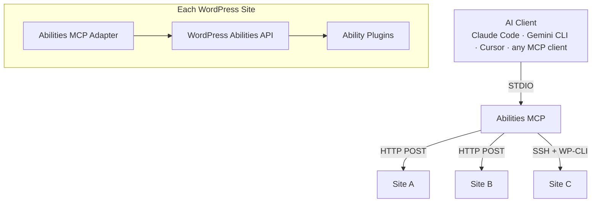

# Abilities MCP

> One MCP to Rule Your WordPress World.

Open-source MCP bridge that connects any AI client to your WordPress sites through the [WordPress Abilities API](https://developer.wordpress.org/reference/functions/wp_register_ability/). Single STDIO server, multi-site routing, zero dependencies.

## Features

- **Multi-site routing** — Single MCP server serves all your WordPress sites
- **Site parameter injection** — LLM sees a `site` enum on every tool, defaults to your primary site
- **Lazy connections** — Sites connect on first use, not at startup
- **HTTP transport** — Application Passwords with MCP session management
- **WordPress multisite** — Subdomain/subdirectory multisites via dot notation (`site.blog`)
- **Auto-reconnect** — Exponential backoff, healthcheck pings, session recovery
- **Zero dependencies** — Node.js built-in modules only

## What You Can Do

The abilities available to your AI agent depend on which ability plugins you install. With [Abilities for AI](https://community.wickedevolutions.com/item/abilities-for-ai/) installed, your agent gets access to:

**Content & Publishing** — content, blocks, patterns, media, menus, taxonomies, comments, revisions
**Site Management** — plugins, themes, settings, users, site health, cache, cron, rewrite rules
**Infrastructure** — filesystem, meta, REST discovery, knowledge layer
**Third-party integrations** — auto-detected modules for supported plugins (Astra, Spectra, SureCart, Presto Player, and more)

**[Abilities for Fluent Plugins](https://github.com/Wicked-Evolutions/abilities-for-fluent-plugins)** is our continuously-enhanced third-party translator — bringing AI control to FluentCRM, FluentCommunity, FluentForms, FluentBooking, FluentSupport, FluentBoards, FluentSMTP, FluentAuth, FluentSnippets, FluentMessaging, FluentCart, and FluentAffiliate. We build and maintain it because we use Fluent's plugins ourselves and wanted them AI-native.

Beyond Fluent, the bridge is plugin-agnostic by design. Any plugin that registers abilities through the WordPress Abilities API becomes available automatically — no configuration in this bridge required. We urge every WordPress plugin developer to prioritize native Abilities API support over anything else.

Every ability enforces `current_user_can()` at execution time — your WordPress role is the security boundary.

> **Sign up for the Abilities for AI alpha release:** https://community.wickedevolutions.com/item/abilities-for-ai/

## Install

There are three install paths. Pick the one that matches how you use AI clients.

### Set up WordPress (required for all paths)

Create a dedicated WordPress user for AI access and generate an Application Password.

**In WordPress Admin → Users → Add New:**

| Field | Value |
|-------|-------|
| Username | `mcp-agent` (or any name you prefer) |
| Role | **Administrator** for full access, or **Editor** for content-only access |

**Then generate an Application Password:**

Go to **Users → Edit (your mcp-agent user) → Application Passwords**, enter a name (e.g. "MCP Bridge"), and click **Add New Application Password**. Copy the generated password — it's shown only once.

#### Choosing a role

| Role | Access | Use case |
|------|--------|----------|
| **Administrator** | All modules — content, plugins, themes, settings, users, cache, cron, filesystem, and more | Full site management |
| **Editor** | Content, Blocks, Taxonomies, Patterns, Meta, Media | Content publishing workflows — safe for teams where AI should write but not configure |

> **Tip:** Start with Editor. Upgrade to Administrator when you need infrastructure abilities like plugin management, theme switching, or settings changes.

#### Required plugins

Install both on your WordPress site:

1. **[Abilities for AI](https://community.wickedevolutions.com/item/abilities-for-ai/)** — registers WordPress abilities across content, site management, infrastructure, and third-party integration modules
2. **[Abilities MCP Adapter](https://community.wickedevolutions.com/item/abilities-mcp-adapter/)** — exposes abilities as MCP tools via REST API

Both are available as free downloads from our store, or install from GitHub: [abilities-for-ai](https://github.com/Wicked-Evolutions/abilities-for-ai) and [abilities-mcp-adapter](https://github.com/Wicked-Evolutions/abilities-mcp-adapter).

---

### Path 1 — `.mcpb` bundle for Claude Desktop (recommended)

Single-click install for Claude Desktop on macOS and Windows. The Application Password is stored encrypted in your OS keychain (macOS Keychain / Windows Credential Manager).

1. Download `abilities-mcp.mcpb` from the [latest GitHub Release](https://github.com/Wicked-Evolutions/abilities-mcp/releases/latest).
2. Double-click the file. Claude Desktop opens an "Install Extension" dialog.
3. Type three things:
   - **WordPress Site URL** — `https://example.com`
   - **WordPress Username** — `mcp-agent`
   - **Application Password** — paste the password from the previous step
4. Click **Install**. The connection is live.

The bundle covers the single-site case. For multi-site (one bridge connected to several WordPress sites at once), use Path 3.

**macOS + Claude Desktop keychain note.** Claude Desktop's `.mcpb` runtime may use Apple's `/usr/bin/security` keychain path when macOS rejects native keytar loading. If you set up OAuth from Terminal and then Claude Desktop repeatedly asks for Keychain access, rerun the terminal setup with the same backend Claude Desktop uses:

```bash
ABILITIES_MCP_KEYCHAIN_BACKEND=security-cli abilities-mcp add-site --force https://example.com
```

This is macOS-only and opt-in. It does not loosen Keychain permissions; it just writes tokens through the same Keychain doorway Claude Desktop reads through.

---

### Path 2 — Env vars (Claude Code, Cursor, Docker, any MCP client)

Install the bridge from npm, then point your client at it with three environment variables:

```bash
npm install -g @wickedevolutions/abilities-mcp
```

In your client's MCP config:

```json
{
  "mcpServers": {
    "wordpress": {
      "command": "abilities-mcp",
      "env": {
        "ABILITIES_MCP_URL": "https://example.com",
        "ABILITIES_MCP_USERNAME": "mcp-agent",
        "ABILITIES_MCP_PASSWORD": "xxxx xxxx xxxx xxxx xxxx xxxx"
      }
    }
  }
}
```

The endpoint is auto-derived as `<URL>/wp-json/mcp/mcp-adapter-default-server`. Single-site only — for multi-site, use Path 3.

For `claude mcp add` users:

```bash
claude mcp add wordpress \
  --env ABILITIES_MCP_URL=https://example.com \
  --env ABILITIES_MCP_USERNAME=mcp-agent \
  --env ABILITIES_MCP_PASSWORD='xxxx xxxx xxxx xxxx xxxx xxxx' \
  -- abilities-mcp
```

---

### Path 3 — `wp-sites.json` (multi-site, power users)

Use this when you connect one bridge to multiple WordPress sites, when you want passwords sourced from a keychain or shell command, or when you're targeting WordPress multisite networks via dot-notation routing.

```bash
cp wp-sites.example.json wp-sites.json
```

Edit `wp-sites.json` with your sites, then add the server to your client's MCP config:

```json
{
  "mcpServers": {
    "wordpress": {
      "command": "node",
      "args": ["/path/to/abilities-mcp/abilities-mcp.js"]
    }
  }
}
```

| Client | Config location |
|--------|----------------|
| Claude Code | `.mcp.json` in project root or `~/.claude/.mcp.json` |
| Claude Desktop | `~/Library/Application Support/Claude/claude_desktop_config.json` (or use `--register`) |
| Gemini CLI | `~/.gemini/settings.json` |
| Cursor | `.cursor/mcp.json` in project root |
| Windsurf | `~/.codeium/windsurf/mcp_config.json` |
| VS Code (Copilot) | `.vscode/mcp.json` in project root |

For Claude Desktop, you can also auto-register:

```bash
node abilities-mcp.js --register
```

## Configuration

### `wp-sites.json`

```json
{
  "defaultSite": "mysite",
  "sites": {
    "mysite": {
      "label": "My WordPress Site",
      "url": "https://example.com",
      "transport": "http",
      "http": {
        "endpoint": "https://example.com/wp-json/mcp/mcp-adapter-default-server",
        "username": "mcp-agent",
        "passwordCommand": "security find-generic-password -a mcp-agent -s example.com -w"
      }
    }
  }
}
```

### Config search order

1. `--config=/path/to/wp-sites.json` (explicit)
2. `wp-sites.json` in the same directory as `abilities-mcp.js`
3. `~/.abilities-mcp/wp-sites.json`
4. `ABILITIES_MCP_URL` / `ABILITIES_MCP_USERNAME` / `ABILITIES_MCP_PASSWORD` env vars (single-site, used by the `.mcpb` bundle)
5. `--host=<ssh-host> --path=<wp-path>` (legacy SSH single-site)

The first one found wins. If a `wp-sites.json` exists, env vars are ignored.

### WordPress Multisite

For WordPress multisites, add a `multisite` object mapping subsite keys to their URLs:

```json
{
  "network": {
    "label": "My Network",
    "transport": "http",
    "http": {
      "endpoint": "https://example.com/wp-json/mcp/mcp-adapter-default-server",
      "username": "mcp-agent",
      "passwordCommand": "security find-generic-password -a mcp-agent -s example.com -w"
    },
    "multisite": {
      "main": "https://example.com/",
      "blog": "https://blog.example.com/",
      "shop": "https://shop.example.com/"
    }
  }
}
```

Use dot notation to target subsites: `"site": "network.blog"`

### Secure password storage

Three options for providing Application Passwords, from most to least secure:

#### `passwordCommand` (recommended)

Runs a shell command at startup and uses stdout as the password. Works with any OS keychain or secrets manager:

```json
{
  "http": {
    "endpoint": "https://example.com/wp-json/mcp/mcp-adapter-default-server",
    "username": "mcp-agent",
    "passwordCommand": "security find-generic-password -a mcp-agent -s example.com -w"
  }
}
```

**macOS Keychain** — store the password first, then reference it:

```bash
# Store (one-time)
security add-generic-password -a mcp-agent -s example.com -w 'YOUR_APP_PASSWORD'

# The passwordCommand retrieves it at runtime
"passwordCommand": "security find-generic-password -a mcp-agent -s example.com -w"
```

**Linux (secret-tool / GNOME Keyring):**

```bash
# Store
secret-tool store --label="WP MCP" service example.com user mcp-agent <<< 'YOUR_APP_PASSWORD'

# Config
"passwordCommand": "secret-tool lookup service example.com user mcp-agent"
```

**1Password CLI:**

```bash
"passwordCommand": "op read 'op://Vault/WordPress MCP/password'"
```

#### `passwordEnv`

Reads the password from an environment variable. Useful in CI/CD, Docker, or when you set secrets via `.env` files:

```json
{
  "http": {
    "endpoint": "https://example.com/wp-json/mcp/mcp-adapter-default-server",
    "username": "mcp-agent",
    "passwordEnv": "WP_MCP_PASSWORD"
  }
}
```

Set the variable before starting the bridge:

```bash
# Shell export
export WP_MCP_PASSWORD="xxxx xxxx xxxx xxxx xxxx xxxx"

# Or in a .env file loaded by your shell/Docker
WP_MCP_PASSWORD=xxxx xxxx xxxx xxxx xxxx xxxx
```

The bridge reads `process.env.WP_MCP_PASSWORD` at connection time. If the variable is not set, it throws an error immediately.

#### `password` (not recommended)

Plaintext password directly in the config. Avoid this — config files end up in repos, backups, and logs:

```json
{
  "http": {
    "password": "xxxx xxxx xxxx xxxx xxxx xxxx"
  }
}
```

#### Priority order

If multiple are set: `passwordEnv` → `passwordCommand` → `password`.

## Bridge Tools

The bridge provides three built-in tools (not forwarded to WordPress):

| Tool | Description |
|------|-------------|
| `wp_bridge_health` | Check connectivity status of all configured WordPress sites |
| `wp_browse_tools` | List WordPress tool categories with counts (requires `toolFilter.enabled: true`) |
| `wp_load_tools` | Activate/deactivate tool categories for lazy loading |

## Usage

### Multi-site mode

When multiple sites are configured, every tool gets an optional `site` parameter:

```json
{
  "name": "content-list",
  "arguments": {
    "site": "staging",
    "post_type": "post"
  }
}
```

Omit `site` to use the default site.

## CLI Options

| Flag | Description |
|------|-------------|
| `--config=<path>` | Path to wp-sites.json |
| `--server=<name>` | MCP adapter server name |
| `--debug` | Enable debug logging to `/tmp/abilities-mcp.log` |
| `--register` | Register in Claude Desktop config |
| `--name=<name>` | Server name for `--register` (default: `wordpress`) |

## Architecture



- One STDIO process handles all sites through a unified connection pool
- **HTTP transport** — Application Passwords with MCP session management, batch coalescing, auto-reconnect
- **SSH transport** — WP-CLI over SSH tunnel, healthcheck pings, handshake replay
- Lazy connections — non-default sites connect on first tool call
- Tool list comes from the default site with `site` enum injected
- Permission metadata (`permission`, `enabled`) flows through annotations to the LLM
- Error responses include `input_schema` for AI self-correction

See [docs/architecture.md](docs/architecture.md) for the full technical deep dive — transport comparison tables, session management, multi-site routing internals, and security model.

## Known Limitations

- **Session lock contention** ([#4](https://github.com/Wicked-Evolutions/abilities-mcp/issues/4)) — Concurrent bridge instances targeting the same site can cause session loss. Use a single bridge process per site.

## Requirements

- Node.js >= 18
- WordPress 6.9+ with [Abilities for AI](https://community.wickedevolutions.com/item/abilities-for-ai/) and [Abilities MCP Adapter](https://github.com/Wicked-Evolutions/abilities-mcp-adapter) installed
- Application Passwords enabled (default in WordPress 5.6+)

## Evolving Knowledge

We continuously add knowledge docs, skills, and agent patterns to [knowledge.wickedevolutions.com](https://knowledge.wickedevolutions.com).

## Disclaimer

Humans make mistakes — as we know from the present day and history. Humans trained AI. AI acts accordingly. AI predicts probability based on the context window it holds. It is trained to sound certain, as if everything is truth, and to "fix" everything so the human becomes satisfied.

Learn how to communicate with AI. You are fully responsible for using AI in your life, business, and projects. Using these products is your personal responsibility to learn and own.

## License

GPL-2.0-or-later
