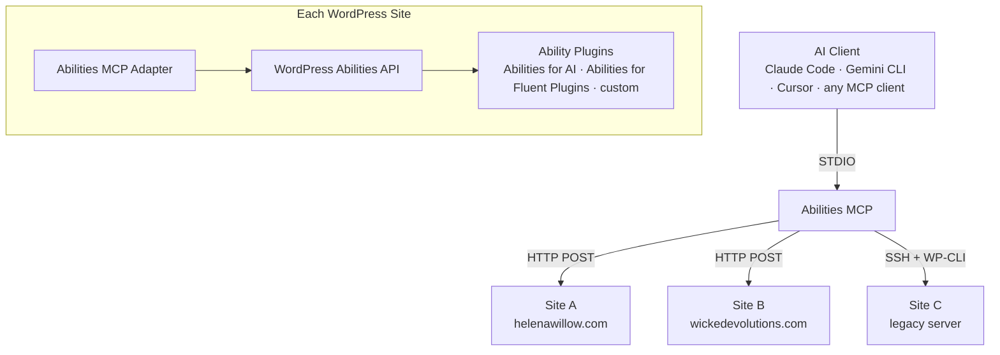

# Architecture

How Abilities MCP connects AI agents to WordPress — transport layer, multi-site routing, session management, and resilience.

## Overview

Abilities MCP is a local Node.js process that bridges the MCP protocol (STDIO) to one or more WordPress sites via the [Abilities MCP Adapter](https://github.com/Wicked-Evolutions/abilities-mcp-adapter) plugin.

**Upstream:** STDIO (AI client to bridge)
**Downstream:** HTTP or SSH per site, configured in `wp-sites.json`

## Components

| Component | Source | Responsibility |
|-----------|--------|----------------|
| `abilities-mcp.js` | Entry point | STDIO listener, message routing |
| `McpRouter` | `lib/router.js` | Dispatches messages to sites, handles bridge tools |
| `ConnectionPool` | `lib/connection-pool.js` | Lifecycle of SSH/HTTP connections, lazy loading |
| `ToolCatalog` | `lib/tool-catalog.js` | Dynamic category filtering for context window management |
| `ToolInjector` | `lib/tool-injector.js` | Injects `site` enum parameter into every tool |
| `HttpTransport` | `lib/transports/http-transport.js` | REST API communication with session management |
| `SshTransport` | `lib/transports/ssh-transport.js` | Remote WP-CLI execution over SSH |
| `Sanitizer` | `lib/sanitizer.js` | Schema validation, strips non-standard fields |

## Transport: HTTP (Recommended)

Connects via HTTPS POST with WordPress Application Passwords. No SSH access required.

| Feature | Detail |
|---------|--------|
| Auth | Basic Auth (username + Application Password) |
| Session tracking | `Mcp-Session-Id` + `Mcp-Session-Token` headers |
| Batch coalescing | 10ms window — concurrent messages coalesced into single JSON-RPC batch POST |
| Cookie jar | Per-host isolation — no cross-site cookie bleed |
| Session recovery | Silent re-handshake on 404/410 (expired) or 401/403 (stale) |
| Retry | 3 retries with exponential backoff on 5xx or network error |
| Request timeout | 120s per request |
| Healthcheck | 45s ping interval |
| Password sources | `passwordCommand` (shell), `passwordEnv` (env var), `password` (plaintext) |

## Transport: SSH + WP-CLI (Developers)

Connects over your existing SSH tunnel. Spawns `wp mcp-adapter serve` on the remote server — zero additional infrastructure, zero open ports.

| Feature | Detail |
|---------|--------|
| Auto-reconnect | Up to 10 retries, exponential backoff (1s → 30s max) |
| Handshake replay | Cached `initialize` request replayed on reconnect — transparent to AI client |
| Healthcheck | 45s ping interval, 10s timeout — kills and respawns on no response |
| Request queue | Up to 100 messages buffered during reconnect |
| Request timeout | 2 minutes per request |
| Multisite | `--url=` flag per subsite |
| Remote cleanup | `pkill -f` on connect and shutdown — prevents orphan WP-CLI processes |

### How SSH + WP-CLI Works

The SSH transport doesn't talk to a web server — it spawns a long-running WP-CLI process over an SSH tunnel:

1. **Bridge opens SSH connection** to the configured host
2. **SSH runs WP-CLI** on the server: `wp mcp-adapter serve` — a custom subcommand from the Adapter plugin
3. **WP-CLI boots WordPress** and hands off to the Adapter's STDIO MCP server
4. **Bridge writes tool calls** to the SSH child's stdin, reads responses from stdout

No web server, no HTTP, no open ports — just an SSH pipe to a PHP process.

## Multi-Site Routing

The bridge serves multiple WordPress sites through a single STDIO process. When multiple sites are configured, every tool gets an optional `site` parameter with an enum of available site keys.

**How it works:**

1. On startup, bridge reads `wp-sites.json` and connects to the default site
2. Non-default sites connect lazily on first tool call
3. `ToolInjector` adds a `site` enum parameter to every discovered tool
4. `McpRouter` inspects the `site` parameter and routes the call to the correct transport
5. If `site` is omitted, the default site handles it

**Multisite subsite routing:**

- Dot notation: `site: "network.blog"` → parent site config + subsite URL
- HTTP: builds per-subsite endpoint URL from subsite origin + parent endpoint path
- WordPress boots natively into the correct blog context — no `switch_to_blog()` needed

## Session Management

Each site connection maintains an independent MCP session:

1. Bridge sends `initialize` request to site
2. Adapter responds with session ID + capabilities
3. All subsequent calls include `Mcp-Session-Id` header (HTTP) or use the same child process (SSH)
4. Connection pool reuses transport per endpoint — no competing connections
5. Handshake is cached for transparent reconnection (SSH) and session recovery (HTTP)

## Tool Catalog (Context Window Management)

At scale (hundreds of abilities), exposing all tools at once can exceed client token limits. The `ToolCatalog` implements a "pay-as-you-go" strategy:

- **`wp_browse_tools`** — lists available categories with tool counts
- **`wp_load_tools`** — activates/deactivates categories for the current session
- **`essentialTools`** — always-visible tools (configured in `wp-sites.json`)
- **`alwaysIncludeCategories`** — categories that are always loaded

Enable with `"toolFilter": { "enabled": true }` in your config.

## Error Passthrough

Both transports fold `_metadata.input_schema` from error responses into the error text. When a tool call fails, the AI agent sees the expected parameter schema alongside the error message — enabling self-correction without a separate discovery call.

## Security Model

- **WordPress role = security boundary.** Every ability enforces `current_user_can()` at execution time
- **Application Passwords** for HTTP auth — revocable, scoped to the MCP user
- **Config file permissions** checked on load — warns if readable by group/world
- **Schema sanitization** strips non-standard fields from WordPress responses
- **Cookie isolation** per hostname prevents session bleed between sites
- **No credentials in the bridge codebase** — passwords come from OS keychain, env vars, or config (gitignored)
